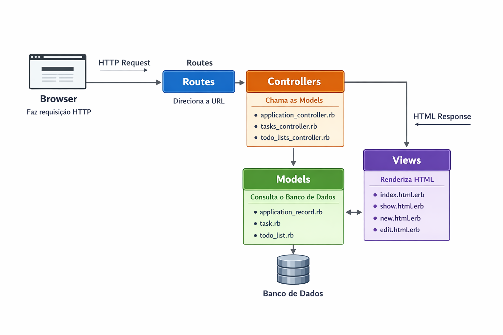

# 📝 Organiza aí 

Organiza aí é uma aplicação web intuitiva voltada para o gerenciamento de tarefas, desenvolvida para ajudar usuários a manterem suas atividades organizadas de maneira simples e eficiente.

A plataforma permite que os usuários:

- Criem múltiplas listas de tarefas, separando atividades por categoria ou projeto.
- Adicionem, editem e removam tarefas individuais dentro de cada lista.
- Marquem tarefas como concluídas, ajudando a visualizar o progresso de cada lista.
- Tenham uma visão clara e organizada das tarefas, facilitando a priorização e o planejamento diário.

A aplicação é ideal tanto para uso pessoal quanto para pequenas equipes que precisam acompanhar atividades de forma simples, sem complexidade de sistemas corporativos.


## 🎯 Objetivo

Desenvolver uma aplicação simples, escalável e de fácil manutenção para gerenciamento de tarefas, demonstrando habilidades em Ruby on Rails, design de banco de dados e boas práticas de desenvolvimento web.

Este projeto foi criado como case para vaga de estágio na V360.

## 🚀 Tecnologias Utilizadas

* **Back-end:** Ruby 3.3.10 e Ruby on Rails 7.1.6
* **Banco de dados:** PostgreSQL
* **Front-end:** HTML5 e CSS3
* **Gerenciamento de pacotes:** Bundler
* **Controle de versão:** Git
* **Servidor local:** Puma (Rails default)

## 📌 Funcionalidades

* Criar, editar e deletar múltiplas listas de tarefas
* Criar, editar e remover tarefas dentro das listas
* Marcar tarefas como concluídas
* Visualizar tarefas organizadas por lista

## 📂 Modelos Principais

* **List** – representa uma lista de tarefas
* **Task** – representa uma tarefa associada a uma lista

Relacionamento:

* `List` **has_many** `Tasks`
* `Task` **belongs_to** `List`

## 🏗️ Arquitetura do Projeto

O projeto utiliza a arquitetura MVC, padrão do Ruby on Rails, que promove a separação de responsabilidades entre as camadas da aplicação, facilitando manutenção, organização e escalabilidade.

1. O **browser** faz uma requisição HTTP.
2. As **routes** direcionam a requisição para o controller correto.
3. O **controller** coordena a ação e chama os models quando necessário.
4. Os **models** acessam o banco de dados e aplicam regras de negócio.
5. O controller envia os dados para a view.
6. A **view** renderiza o HTML e devolve a resposta ao browser.

A imagem abaixo representa o fluxo da arquitetura MVC utilizada no projeto:




## 🛠️ Como rodar o projeto

### Pré-requisitos

* Ruby >= 3.3.10
* Rails >= 7.1.6
* PostgreSQL instalado e rodando

### Passos

1. Clone o repositório:

```bash
git clone <https://github.com/Beatriz-ge/Case-V360>
cd desafio_v360
```

2. Instale as dependências do projeto:

```bash
bundle install
```

3. Configure o banco de dados PostgreSQL:

```bash
rails db:create
rails db:migrate
```

4. Inicie o servidor Rails:

```bash
rails server
```

5. Acesse a aplicação no navegador:

```
http://localhost:3000
```


## 📖 Estrutura do Projeto

```
app/
├─ controllers/    # Lógica do backend
├─ models/         # Modelos List e Task
├─ views/          # Views HTML/ERB
└─ assets/         # CSS
db/
├─ migrate/        # Migrations do banco
├─ schema.rb
```

## 🔗 Referências

* Documentação Rails – [https://guides.rubyonrails.org/](https://guides.rubyonrails.org/)


